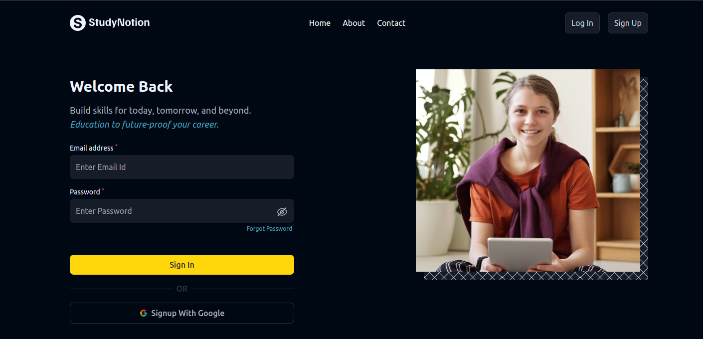

# Study Notion
- Signup/login functionality
- no local storage but the data is retrieved in an object
- Tailwind CSS for Styling, not responsive
- flow: home -> signup/login -> dashboard -> logout
- new concepts:
  - Browser Router - stores the current location in the browsers address bar using clean URLs
  - Private Routes (dashboard only appears on login)
  - Use of Template
  - Multi-state handling
  - Multiple components which appear to be as different pages

# Snapshot of Login
